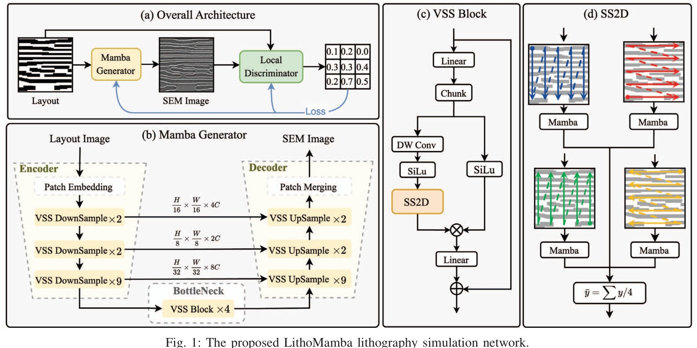
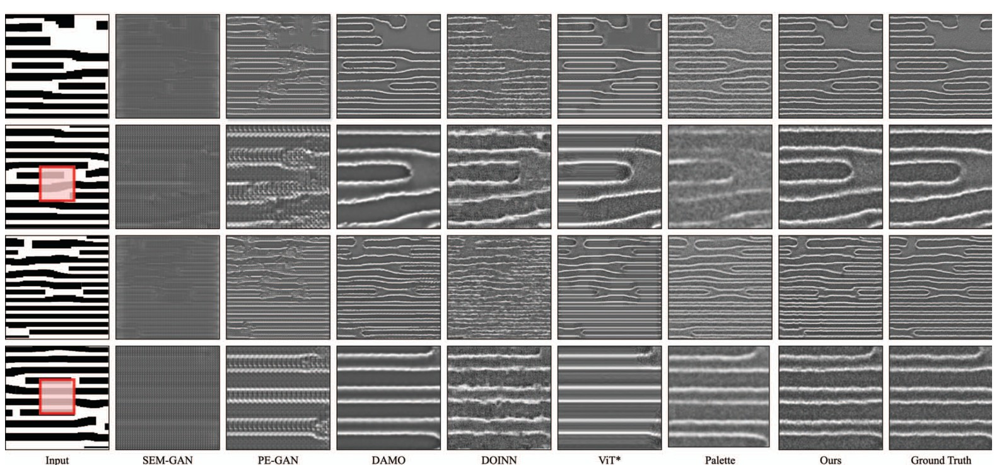

<div align="center">

# LithoMamba

### High-fidelity lithography simulation with State Space Models

**DATE 2026** · Layout-to-SEM image synthesis

[](https://doi.org/10.23919/DATE69613.2026.11539705)
[](#installation)
[](#installation)
[](LICENSE)

[Paper](https://doi.org/10.23919/DATE69613.2026.11539705) · [Conference PDF](https://past.date-conference.com/proceedings-archive/2026/DATA/670.pdf) · [Quick start](#quick-start) · [Citation](#citation)

Xinyu He · Daohui Wang · Shujing Lyu · Pourya Shamsolmoali · Jiwei Shen · Yue Lu

East China Normal University · Shanghai Innovation Institution

</div>

## Overview

LithoMamba translates IC layout masks into realistic scanning electron microscope (SEM) images. A **Mamba generator** captures long-range interactions through selective state-space modeling, while a **local convolutional discriminator** supplies spatial feedback for fine pattern details.

This is the author-maintained research code accompanying the DATE 2026 paper. The repository was previously named **Mask2Litho**; the old README's **MPGNet** title has been replaced with the published paper identity.



- **Global modeling:** a hierarchical encoder-decoder with Visual Selective Scan blocks.
- **Topology-aligned scanning:** horizontal and vertical scans in both directions reflect IC layout structure.
- **Local feedback:** a fully convolutional discriminator predicts a spatial score map.
- **High-resolution synthesis:** the paper evaluates layout-to-SEM prediction at 1024 × 1024 resolution.

## Results reported in the paper

The 14 nm benchmark contains **3,200 layout/SEM pairs**, split 3:1 for training and testing. Table I reports:

| Method | IoU ↑ | PA ↑ | F1 ↑ | FID ↓ | PSNR ↑ | SSIM ↑ |
|:--|--:|--:|--:|--:|--:|--:|
| SEM-GAN | 0.61 | 0.64 | 0.74 | 275.42 | 16.42 | 0.19 |
| PE-GAN | 0.86 | 0.90 | 0.92 | 266.53 | 16.54 | 0.22 |
| DAMO | 0.91 | 0.93 | 0.95 | 173.23 | 16.90 | 0.21 |
| DOINN | 0.90 | 0.93 | 0.95 | 89.71 | 16.93 | 0.25 |
| ViT* | 0.92 | 0.94 | 0.95 | 274.82 | 16.24 | 0.27 |
| Palette | 0.86 | 0.88 | 0.91 | 97.87 | 16.73 | 0.30 |
| **LithoMamba** | **0.94** | **0.96** | **0.96** | **33.54** | **17.21** | **0.32** |



Table II also reports results on REFICS at 32 nm and 90 nm:

| Node | IoU ↑ | FID ↓ | PSNR ↑ | SSIM ↑ |
|:--|--:|--:|--:|--:|
| 32 nm | 0.84 | 41.60 | 18.62 | 0.37 |
| 90 nm | 0.78 | 47.37 | 17.04 | 0.34 |

These values are transcribed from the published paper. They have **not been remeasured with this cleaned code release**. The paper reports an NVIDIA RTX 4090; historical logs may reflect earlier experiments.

## Release status

| Component | Availability |
|:--|:--|
| Mamba generator and local discriminator | Included |
| Training and paired inference entry points | Included, with release maintenance fixes |
| Historical training logs | Included in `logs/`; not a verified final-paper reproduction bundle |
| 14 nm manufacturing dataset | Not distributed |
| Prepared REFICS layout/SEM pairs | Not bundled; obtain data from its source and prepare matching pairs |
| Trained LithoMamba weights / optional VMamba initialization | Not bundled |
| Complete paper evaluation and all baseline training pipelines | Not included |

The current release retains the historical model architecture and LSGAN objective. Differences from the final paper, including loss settings, discriminator activation and generator depth, are documented in [the code review](docs/CODE_REVIEW.md). Exact reproduction requires the final experiment configuration and suitable data/checkpoints.

## Installation

Use **Linux with an NVIDIA CUDA GPU**. The selective-scan implementation imports CUDA kernels from `mamba-ssm`; CPU and Apple MPS are not supported for full LithoMamba execution. Python 3.10+ and PyTorch 2.5 are the reference dependency versions.

```bash
git clone https://github.com/screw-44/LithoMamba.git
cd LithoMamba
conda env create -f environment.yml
conda activate lithomamba

# Install after PyTorch is available. Building extensions requires a compatible
# CUDA toolkit (including nvcc) and a compiler.
python -m pip install "causal-conv1d==1.4.0" --no-build-isolation
python -m pip install "mamba-ssm==2.2.2" --no-build-isolation
```

`environment.yml` replaces an old machine-specific macOS export with a minimal reference environment. CUDA extension installation and full GPU training have not been validated on the macOS review host. Verify your setup before training:

```bash
python -c "import torch; from mamba_ssm.ops.selective_scan_interface import selective_scan_fn; print(torch.__version__, torch.version.cuda, torch.cuda.is_available())"
python train_mamba.py --help
python test.py --help
```

## Data preparation

Place grayscale layouts and their matching SEM targets in separate directories. Images are paired by **relative filename without the extension**, so `layout/sample_001.png` can match `sem/sample_001.bmp`. Subdirectory names must also match. Unmatched names, duplicates and inconsistent pair dimensions raise errors.

```text
datasets/
├── train/
│   ├── layout/sample_001.png
│   └── sem/sample_001.bmp
└── test/
    ├── layout/sample_002.png
    └── sem/sample_002.bmp
```

The loader converts images to one grayscale channel, applies shared geometric augmentation during training, and normalizes values to `[-1, 1]`. Testing uses deterministic preprocessing. Use `--load_size 1024 --crop_size 1024` to retain the paper's spatial resolution; smaller sizes are for development and are not comparable to paper results.

The 14 nm manufacturing data are subject to confidentiality restrictions. Contact [hexinyu@stu.ecnu.edu.cn](mailto:hexinyu@stu.ecnu.edu.cn) about data and checkpoint availability. For REFICS, follow the original dataset's access and usage terms; no raw dataset is uploaded here.

## Quick start

### Train

The following command selects the paper's stated reconstruction coefficient, `λ = 0.1`, and disables the historical extra edge-region term. It does **not** resolve the other model/configuration differences listed in the code review.

```bash
python train_mamba.py \
  --name lithomamba \
  --gpu_ids 0 \
  --layout_image_dir ./datasets/train/layout \
  --sem_image_dir ./datasets/train/sem \
  --load_size 1024 --crop_size 1024 \
  --batch_size 2 --num_workers 4 --shuffle \
  --lr 0.0002 --beta1 0.5 \
  --lambda_l1 0.1 --lambda_edge 0 \
  --epochs 500 --display_freq 20
```

`--epochs 500` is the historical script's budget, not an independently verified final-paper schedule. If desired, initialize the generator with an available compatible VMamba checkpoint using `--pretrained_path /path/to/vmamba_tiny_e292.pth`. Leaving this option unset trains from random initialization. Inference and warm starts do not require this initialization file.

For historical loss settings, use `--lambda_l1 1 --lambda_edge 1`; the retained edge threshold is `240/255` in the **normalized tensor domain**. Add `--no-fp16` to disable mixed precision.

Checkpoints are stored under `checkpoints/<name>/` as `epoch_<epoch>_G.pth`, `epoch_<epoch>_D.pth` and `epoch_latest_{G,D}.pth`, alongside preview images and `iter.txt`.

To continue from saved model weights, rerun the same command with `--continue_train --which_epoch latest`. This is a **weight warm start**: optimizer and AMP scaler states are not restored, so it is not an exact interrupted-run continuation.

### Generate SEM predictions

Place the trained generator at `checkpoints/lithomamba/epoch_latest_G.pth`, then run:

```bash
python test.py \
  --name lithomamba --which_epoch latest \
  --gpu_ids 0 \
  --layout_image_dir ./datasets/test/layout \
  --sem_image_dir ./datasets/test/sem \
  --load_size 1024 --crop_size 1024 \
  --batch_size 1 --num_workers 4 \
  --num_test 800 \
  --results_dir ./results/lithomamba
```

This entry point currently consumes paired data, including SEM target files. It uses the Mamba generator in evaluation/inference mode and saves predictions as PNG files, preserving the layout subdirectories. It does not compute the paper's six evaluation metrics.

## Repository structure

```text
model/mamba/             MambaGAN wrapper and selective-scan generator
model/network_module.py  Local discriminator and adversarial loss
model/cfno.py            Fourier baseline model definition
model/doinn.py            DOINN baseline model definition
model/trans/             Transformer baseline components
data/                    Paired image loader and augmentation
options/                 Training and inference arguments
train_mamba.py           Training entry point
test.py                  Paired inference entry point
logs/                    Historical experiment logs
docs/CODE_REVIEW.md       Maintenance fixes and paper/code differences
assets/                  Paper architecture and qualitative comparison
```

Other files are historical experiment utilities; their presence does not imply complete, runnable baseline reproduction pipelines. `caseStudy_defectDetection.py` is an optional CLIP-based exploratory utility, not the paper's evaluation protocol.

## Validation

Maintenance regression tests cover full-batch adversarial loss, paired-data handling, deterministic augmentation, checkpoint device preservation, and both command-line help entry points. They can run on CPU without Mamba CUDA extensions:

```bash
python -m pip install pytest
python -m pytest -q tests
```

See [the code review](docs/CODE_REVIEW.md) for the validation scope and remaining reproduction gaps.

## Citation

```bibtex
@inproceedings{he2026lithomamba,
  title     = {{LithoMamba}: High-fidelity lithography simulation with State Space Models},
  author    = {He, Xinyu and Wang, Daohui and Lyu, Shujing and Shamsolmoali, Pourya and Shen, Jiwei and Lu, Yue},
  booktitle = {2026 Design, Automation \& Test in Europe Conference (DATE)},
  year      = {2026},
  pages     = {1--6},
  doi       = {10.23919/DATE69613.2026.11539705}
}
```

## Acknowledgements and license

The generator builds on [Mamba](https://github.com/state-spaces/mamba), [VMamba](https://github.com/MzeroMiko/VMamba), and [Mamba-UNet](https://github.com/ziyangwang007/Mamba-UNet). Please also cite the relevant upstream work when using these components. Imported components retain their upstream attribution and license obligations.

Repository code is provided under the [Apache 2.0 license](LICENSE). Paper figures and third-party data remain subject to their respective terms.

Questions about the implementation or data: [open an issue](https://github.com/screw-44/LithoMamba/issues) or contact [hexinyu@stu.ecnu.edu.cn](mailto:hexinyu@stu.ecnu.edu.cn).
